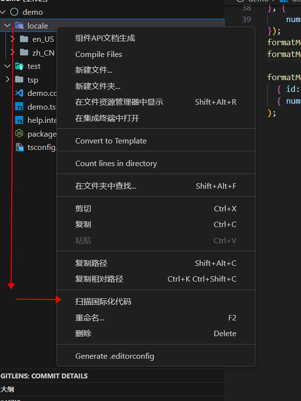
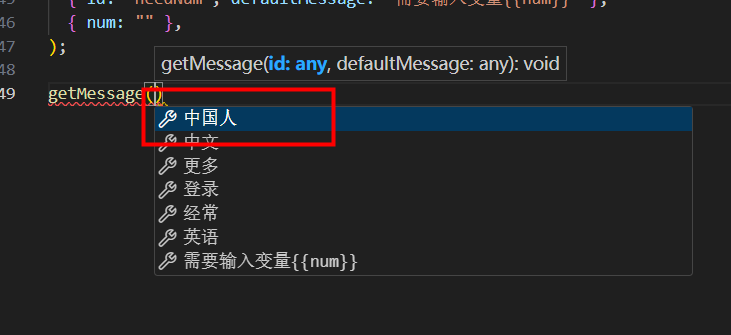
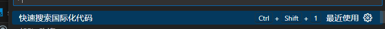
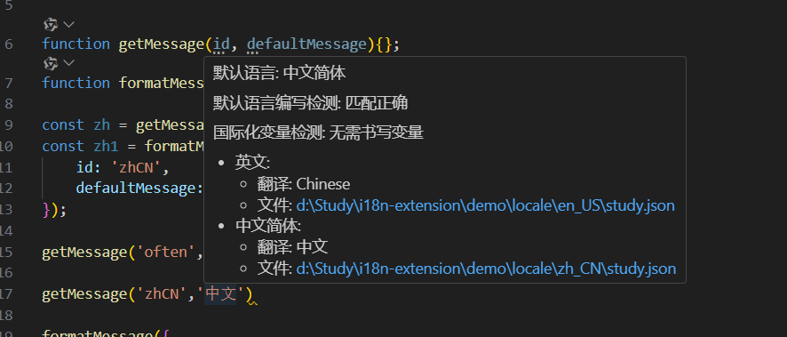
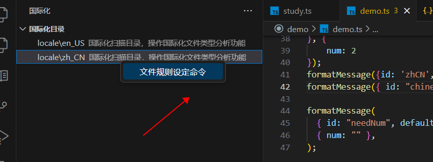

# i18n 个人使用插件

## 功能

### i18n CodeGen

生成 i18n 代码相关，目前所有的代码生成都是生成单个工作。

- 选中国际化键值对，右键 `提取国际化代码`, 可以唤起菜单生成国际化代码。
  
- 输入模板中的国际化函数调用会唤起查询所有国际化 key 和 默认国际化文本你，并返回候选项提供给用户选择。（当 key 量级非常多时很卡）
  -  
- 选中默认国际化文本，右键`选中文本转国际化`，生成国际化代码
- 快速搜索国际化代码, ctrl + p 查找命令，会提供一个 国际化 key 供选择。
  - 
### i18n Info

- 悬浮信息，提供了国际化 key 的所有翻译信息以及相关页面跳转，提供翻译文本是否需要变量。
  - 
- 自定义跳转路径

## 使用

首先去配置国际化插件配置，有几个比较重要的配置。

Scan Folders 如果目录不是 locales 或 locale 的话，需要配置它。
Main Language 默认语言这个非常重要，请设置自己项目中国际化用到的默认语言。
Generate Templates 生成模板种类，非常重要扩展的工作都是基于这个核心触发提供的，需要你提供一个或多个日常常用的国际化代码，并将他们的国际化 key 字面量 替换成 {{id}} 国际化默认语言替换成 {{msg}} 如果有变量的话,则把变量对象字面量替换 {{variable}} 。

```jsonc
{
  	// 配置这里的，需要编写的国际化代码模板
		"i18n-extension.generateTemplates": [
			"formatMessage({id: '{{id}}',defaultMessage: '{{msg}}',},{{variable}})",
			"formatMessage({id: '{{id}}'})",
			"intl.formatMessage({id: '{{id}}',\ndefaultMessage: '{{msg}}',})"
		],
		// 这里是工作语言
		"i18n-extension.mainLanguage": "ZH_CN",
		// 这是支持扫描国际化的目录名
		"i18n-extension.scanFolders": [
			"locales",
			"locale"
		]
		// 配置完，扫描目录
}
```

扫描国际化目录，扫描成功.


如果项目存在繁体语言，使用扩展提供的国际化目录在里面覆盖国际化语言类型，这样扩展正确识别语言类型



接下来，就是愉快的编码工作了。

作者：孤独之舟
链接：https://juejin.cn/post/7322714226291720202
来源：稀土掘金
著作权归作者所有。商业转载请联系作者获得授权，非商业转载请注明出处。

## 版本变更

[ 更新文档 😊✌ ](./CHANGELOG.md)

## 计划

- [x] 支持 jsx，tsx智能提示
- [x] 国际化悬浮信息 (粗略完成)
- [x] 文件位置关联 (粗略完成)
- [x] 根据键值对动态生成扫描代码配置
- [x] 完善扫描代码分步计划 (目前在执行清理无效配置后，自动重新执行扫描命令，适配右键菜单合，执行上下文类型)
- [x] 文本自动生成代填充 key:value 形式 填充到项目文件夹中
- [ ] 翻译 Api (开发中……) 这里有一些问题，目前没有想好如何消费这些，还有提供这些文本翻译
  - [ ] 项目内非国际化目录下单文本翻译多语种如何消费，或者不该使用
  - [ ] 在国际化目录下如何生成任务文本
    - [ ] 依据国际化 key 规则识别
    - [ ] 依据配置识别，然后依靠询问的方式进行配置，似乎上面的约定，比这个好，不过这个是我最初的想法。
    - [ ] 获取任务文与根目录，生成对应文件，进行读写。
  - [ ] 对接翻译平台 Api
    - [x] 百度
    - [ ] 彩云
    - [ ] 谷歌
    - [ ] Deep
    - [x] 网易
    - [ ] 腾讯
- [ ] 国际化视图
  - [x] 扫描目录规则输出文件规则配置
  - [x] 扫描目录时启用规则命令
- [ ] 项目非国际化目录生成可识别的国际化文本
- [ ] 扫描默认语种字符串，并读取现有可读国际化作用域作为输出
- [ ] 新增额外的自动录入国际化文本（路径采用多级询问，自动创建，同步，读写 ts, js, json 能力的方式）
- [x] 动态模板生成动态正则作为解析
- [x] 识别可翻译字符串或者关键 key 生成国际化代码
  - [x] 添加是否询问配置
  - [x] 支持识别国际化key 和 主语言 value
- [ ] 添加可爱的助手 https://github.com/tensorflow/tfjs-examples。 不知道行不行。
  - [ ] 辅助
  - [ ] 自主
  - [ ] 环保

## pakcage 部分注释参考

### 如何编写类似 复制为 这样的子级的菜单

我一开始以为需要写在 menus 这里面，的确是，但是我少了一个层级。原先的隶属菜单属于 `editor/context` 后面参考 https://github.com/microsoft/vscode/issues/100172#issuecomment-645203070 以及灵机一动终于搞懂了，我缺少了一个层级，如果是自定义的多级菜单，则需要把父级菜单注册到 submenus 这个字里面，否则就无需处理。
